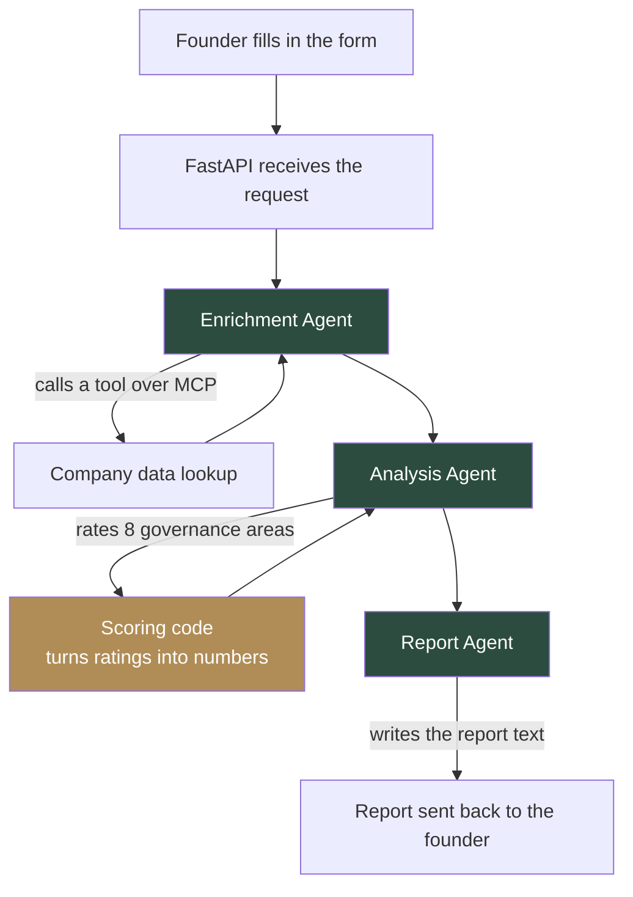
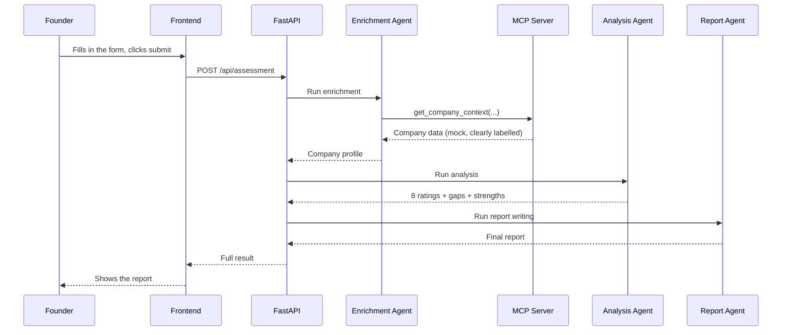
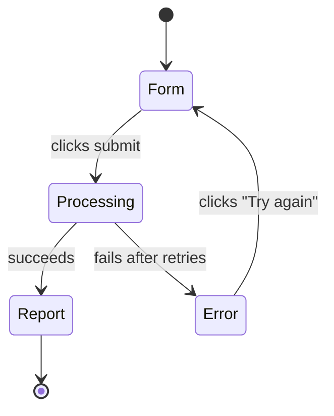

<div align="center">

# Board Readiness Score

**A free tool that tells startup founders exactly which senior advisor they need — built as a lead magnet for Connectd.**

### 🔗 [Try it live](https://board-readiness-score-jawu4xfblxrfmrbmglxi87.streamlit.app/)

</div>

---

## What this is

Connectd connects startups with senior executives who join their board or advise them, for free, for a few months. The hard part isn't convincing founders that this is valuable — it's that most founders haven't stopped to work out *exactly* what kind of senior help they're missing.

This tool solves that. A founder answers a few questions about their company. Three AI agents work together behind the scenes to read the answers, look deeper into the company, and write a short, personal report: where the company is strong, where it's exposed, and what kind of advisor would help. The report ends with an invitation to get matched with Connectd.

It's not a mockup. Every part of this is built and working — three AI agents, a real MCP tool server, a scoring system that shows its work, and a clean web page to tie it together.

---

## See it in action

A founder fills in a short form:

| Field | Example |
|---|---|
| Company name | Meridian Health |
| Stage | Series A |
| Industry | Digital Health |
| Team size | 28 |
| Current challenges | Slower commercial traction than expected |

A few seconds later, they get a full report — a score out of 100, a breakdown across 8 governance areas, specific gaps with reasoning, and a next-steps list. Every gap comes with a suggested type of advisor to fill it.

---

## How it works

Three AI agents run one after another, each with exactly one job. No agent calls itself in a loop, no agent does more than one thing — this keeps the system easy to test, easy to debug, and easy to explain.



**Enrichment Agent** — takes what the founder typed, looks up extra context about the company, and combines both into one clean profile. This step doesn't use AI reasoning at all — it's a straightforward lookup and merge, so there's nothing here for an AI to get wrong.

**Analysis Agent** — reads the company profile and rates it across 8 areas (things like financial oversight, board structure, leadership depth). It only ever gives a simple rating — *strong*, *adequate*, *emerging*, or *absent* — never a raw number.

**Report Agent** — takes those ratings and writes them up as something a founder would actually want to read. It's only allowed to write sentences, never new facts — the evidence and advisor suggestions are copied straight from the Analysis Agent's output, so it can't invent anything.

### Why the score isn't just "AI picks a number"

Asking an AI to "give this a score out of 100" produces a number nobody can explain or reproduce. Instead:

1. The AI gives a plain rating for each of the 8 areas (strong / adequate / emerging / absent)
2. Our own code — not the AI — turns each rating into a number (strong = 85, adequate = 60, emerging = 35, absent = 10)
3. The final score is just the average of those 8 numbers

Same input always gives the same score. Nothing hidden, nothing random.

---

## One request, step by step

Here's what actually happens, in order, when a founder submits the form:



If any step fails — the AI is slow, the connection drops, the output comes back malformed — the system catches it, tries again, and only gives up after a few honest attempts. The founder gets a clear message, not a crash.

---

## What the founder sees



The page itself is deliberately plain — no gradients, no stock AI-app look. It's meant to feel like reading a short memo from an advisor, not using a SaaS dashboard.

---

## What's real, what's a placeholder

Being upfront about this matters more than pretending everything is finished:

| Part | Status |
|---|---|
| The 3 AI agents | Real, working, tested |
| The MCP tool server | Real — a genuine tool call over the real protocol |
| The scoring system | Real, deterministic, tested |
| Company lookup data | **Mock** — stands in for a real data source like Crunchbase, clearly labelled as mock everywhere it appears |
| Storage | In-memory — resets if the server restarts. A real version would use a proper database |
| Lead routing to Sachin/Will | Described in this README, not yet wired to a real CRM |

---

## How this would grow into something Connectd could actually run

The local version proves the idea works. Here's what would change to run it for real, at scale:

- **Swap the mock company lookup for a real one** — Crunchbase, LinkedIn, or Companies House. Nothing about the agents would need to change, since they only ever talk to the lookup tool, never the data behind it directly.
- **Add a real database** — so reports don't disappear when the server restarts.
- **Score every lead, not just the report** — a separate, simple scoring system (already built, see below) rates each submission as hot, warm, or low, so the best leads reach Sachin and Will directly instead of getting lost in a pile.
- **Send the report by email**, not just show it on screen, so it becomes something the founder keeps.
- **Run the heavy AI steps in the background** instead of making the founder wait on the same request — so the page feels instant even if the AI takes a few seconds.

### The lead-scoring layer

Separate from the readiness score, every submission also gets scored on how good a *lead* it is for Connectd — based on company stage, team size, how serious the gaps are, and whether the founder explicitly asked for help. This is a simple, transparent points system, not a black box:

- **Hot** → goes straight to Sachin and Will
- **Warm** → goes into a nurture sequence
- **Low** → gets general educational content instead

---

## Try it yourself

### Fastest option: Groq (free, takes seconds per report)

1. Get a free key at [console.groq.com/keys](https://console.groq.com/keys)
2. Copy the example environment file: `cp .env.example .env`
3. Open `.env` and set `MODEL_PROVIDER=groq` and paste in your key

### Or: run it fully offline with Ollama (free, but slower on a laptop)

```bash
ollama serve
ollama pull llama3.2
```
Then leave `MODEL_PROVIDER=ollama` in your `.env`.

### Then, either way:

```bash
python3 -m venv venv
source venv/bin/activate
pip install -r requirements.txt

# Terminal 1 — backend
uvicorn app.main:app --reload

# Terminal 2 — frontend
cd frontend && python3 -m http.server 5500
```

Open `http://localhost:5500`, fill in the form, and try it.

### Run the tests

```bash
pytest tests/ -v
```

33 tests, covering the scoring logic, the data validation, the MCP tool, the full pipeline (including failure cases), and the API — all pass without needing Ollama or Groq running, since they use mocked agents to test the plumbing on its own.

---

## What's inside

```
app/
  agents/          the 3 agents: enrichment, analysis, report
  orchestration/    runs the agents in order, handles failures
  scoring/          the readiness score and the lead score — both deterministic
  models/           the exact shape of every piece of data
  services/         the MCP client, and the AI provider (Ollama or Groq)
  api/              the actual web endpoints

mcp_server/         the MCP tool server (mock company data)
frontend/           the web page — form, loading state, report
prompts/            what we actually ask the AI to do, kept separate from code
tests/              33 tests
eval/               3 fictional startups, for checking report quality by hand
```

---

## A note on how this was built

This was built in stages — get the data shapes right first, then one agent at a time, testing each one properly before moving to the next, rather than writing the whole thing at once and hoping it works. Every piece that doesn't need an AI (the scoring, the data merging, the routing logic) is plain, testable code. AI is only used for the two things it's actually good at here: judging governance maturity from context, and writing it up in clear prose.
